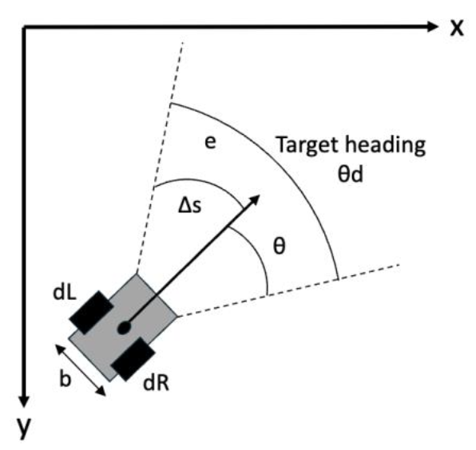
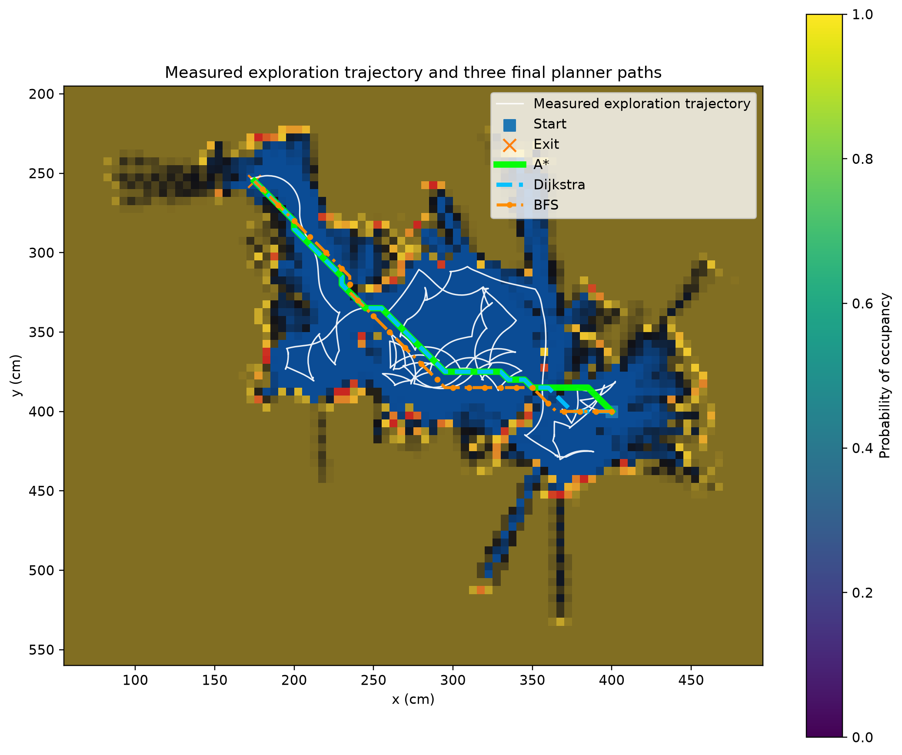
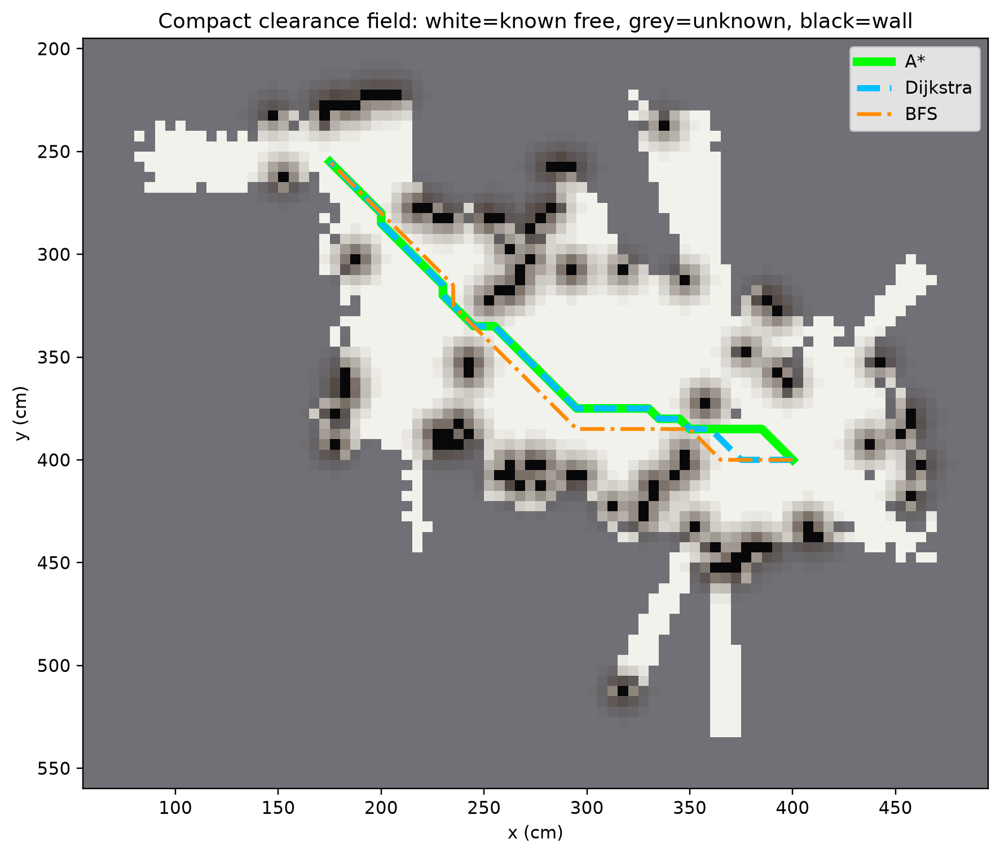
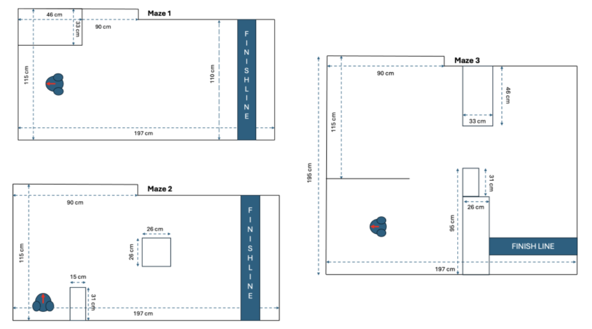

# SLAM-and-Ultrasonic-Sensing-for-Mobile-Robots
This project explores whether a low-cost robot with only one forward ultrasonic sensor can localise itself and draw an occupancy-grid map of the surroundings.

This project does not use ROS

### Demo

[Watch the robot navigation demo](images/ComplexMaze_Clip.mp4)

## Main Features

- Differential-drive odometry using wheel encoder data
- IMU yaw-based heading estimation
- Probabilistic occupancy-grid mapping with log-odds updates
- Centre-dominant ultrasonic inverse sensor model
- Frontier-based exploration for unknown environments
- PID heading control for more stable movement
- Safety and recovery behaviours for wall contact and stuck situations
- Local scan matching to reduce accumulated pose error
- Conservative loop-closure verification using keyframes and scan descriptors
- Pose-graph optimisation after successful exit detection
- Exit detection using RGB sensors and a white-paper finish marker
- Final path comparison using A*, Dijkstra, and Breadth-First Search

## Limitations

Because the robot used only a single forward ultrasonic sensor, the generated maps were sometimes sparse and incomplete. Odometry drift, wheel slip, wall contact, and limited sensor coverage affected map accuracy. The final path-planning algorithms were therefore optimal only with respect to the map produced by the robot, not necessarily the complete real-world maze.

## Future Improvements

Possible improvements include adding side or rear sensors, using LiDAR or depth cameras, improving pose estimation with a probabilistic filter, integrating ROS 2, and testing more advanced robot-learning or Physical AI approaches.

### Robot Localisation Geometry

### Heatmap

A*, Dijkstra, and BFS were calculated on the frozen map after exit detection to find out the most optimal travel route. 

### Navigation Likelihood Field

Obstacle inflation. The fading halos around obstacles meant the closer the robot got to the obstacles, the heavier punishment. This encouraged the robot to keep a safe distance while navigating to avoid collision or wheel snag. 

### Different Maze Layouts

3 mazes - each with different purposes were built to test the robot. Maze 1 mostly contained open space. Maze 2 required an L-shaped turn to clear the starting position and subsequently navigated around a big obstacle in the middle. Maze 3 consisted of long connected walls that increase the probability of revisits where loop closure and pose-graph optimisation could be applied to reduce odometry drift.
